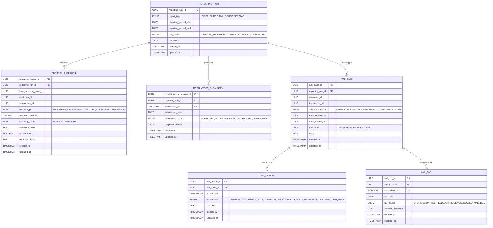

# Core Lending Regulatory Compliance

A microservice component of the **Firefly OpenCore Banking Platform** that handles regulatory compliance and reporting for lending operations.

## Overview

The Core Lending Regulatory Compliance service is a critical component of the Firefly OpenCore Banking Platform, developed by **Firefly Software Solutions Inc** under the **Apache 2.0 license**. This microservice is responsible for managing regulatory compliance requirements for lending operations, ensuring financial institutions meet their regulatory obligations.

### Key Features

- **Anti-Money Laundering (AML) Case Management**: Complete lifecycle management of AML investigations
- **Suspicious Activity Reports (SAR) Processing**: Creation, submission, and tracking of SARs
- **Regulatory Reporting**: Support for multiple regulatory frameworks (CIRBE, FINREP, AML, COREP, SEPBLAC)
- **Compliance Record Management**: Comprehensive audit trails and compliance documentation
- **Real-time Monitoring**: Reactive processing for immediate compliance alerts

This service provides a fully reactive API built on Spring WebFlux for efficient, non-blocking handling of compliance-related operations.

## Architecture

This microservice follows a clean, modular architecture with clear separation of concerns:

```
core-lending-regulatory-compliance/
├── core-lending-regulatory-compliance-core/       # Business logic and service implementations
├── core-lending-regulatory-compliance-interfaces/ # DTOs and public interfaces
├── core-lending-regulatory-compliance-models/     # Data models and repositories
├── core-lending-regulatory-compliance-sdk/        # Client SDK for integration
└── core-lending-regulatory-compliance-web/        # REST API controllers and application entry point
```

### Technology Stack

- **Java 21**: Utilizing the latest Java features including virtual threads and pattern matching
- **Spring Boot 3.x**: Modern application framework with native compilation support
- **Spring WebFlux**: Reactive web framework for non-blocking I/O
- **R2DBC**: Reactive database connectivity for PostgreSQL
- **PostgreSQL 14+**: Primary database with advanced JSON and UUID support
- **Flyway**: Database migration and versioning
- **OpenAPI 3.0**: API documentation and specification
- **Maven**: Build automation and dependency management
- **Docker**: Containerization support

## Module Structure

### core-lending-regulatory-compliance-interfaces

Contains Data Transfer Objects (DTOs), enums, and public interfaces that define the service contract. This module:
- Has minimal dependencies for easy integration
- Includes comprehensive validation annotations
- Can be shared with client applications
- Defines all API contracts and data structures

### core-lending-regulatory-compliance-models

Contains database entity models and repository interfaces. This module:
- Handles data persistence using R2DBC for reactive operations
- Includes Flyway migration scripts
- Defines entity relationships and constraints
- Provides reactive repository implementations

### core-lending-regulatory-compliance-core

Contains the business logic and service implementations. This module:
- Implements interfaces defined in the interfaces module
- Contains all business rules and validation logic
- Provides service layer abstractions
- Handles complex compliance workflows

### core-lending-regulatory-compliance-sdk

Provides a client SDK for easy integration with other services:
- Generated OpenAPI client
- Type-safe API interactions
- Reactive client implementations
- Integration utilities

### core-lending-regulatory-compliance-web

Contains REST API controllers and application entry point:
- Exposes RESTful endpoints
- Handles HTTP request/response mapping
- Provides OpenAPI documentation
- Includes security and monitoring configurations

## Data Model

The service manages the following core entities with their relationships:



## API Endpoints

The service provides comprehensive RESTful APIs organized by domain:

### AML (Anti-Money Laundering) Management

- **AML Cases**: `/api/v1/aml-cases`
  - Full CRUD operations for AML case lifecycle management
  - Advanced filtering and search capabilities
  - Status transition validation and workflow management

- **AML Actions**: `/api/v1/aml-cases/{amlCaseId}/actions`
  - Track investigative actions within AML cases
  - Support for multiple action types and outcomes
  - Chronological action history

- **Suspicious Activity Reports**: `/api/v1/aml-cases/{amlCaseId}/sars`
  - SAR creation, submission, and tracking
  - Authority feedback management
  - Status progression monitoring

### Regulatory Reporting

- **Reporting Runs**: `/api/v1/reporting-runs`
  - Manage regulatory reporting cycles
  - Support for multiple report types (CIRBE, FINREP, AML, COREP, SEPBLAC)
  - Run status tracking and error handling

- **Reporting Records**: `/api/v1/reporting-runs/{reportingRunId}/records`
  - Individual record management within reporting runs
  - Inclusion/exclusion logic with audit trails
  - Multi-currency support

- **Regulatory Submissions**: `/api/v1/reporting-runs/{reportingRunId}/submissions`
  - Submission tracking to regulatory authorities
  - Response handling and status updates
  - Submission reference management

## Setup and Installation

### Prerequisites

- **Java 21** or higher (with virtual threads support)
- **Maven 3.8** or higher
- **PostgreSQL 14** or higher (with UUID and JSON support)
- **Docker** (optional, for containerized deployment)

### Environment Variables

Configure the following environment variables for database connectivity:

```bash
# Database Configuration
DB_HOST=localhost
DB_PORT=5432
DB_NAME=regulatory_compliance
DB_USERNAME=postgres
DB_PASSWORD=your_secure_password
DB_SSL_MODE=disable

# Application Configuration
SPRING_PROFILES_ACTIVE=dev
SERVER_PORT=8080

# Logging Configuration (optional)
LOGGING_LEVEL_ROOT=INFO
LOGGING_LEVEL_FIREFLY=DEBUG
```

### Building the Application

```bash
# Clone the repository
git clone https://github.com/firefly-oss/core-lending-regulatory-compliance.git
cd core-lending-regulatory-compliance

# Build all modules
mvn clean install

# Run tests
mvn test

# Build without tests (faster)
mvn clean install -DskipTests
```

### Database Setup

1. **Create PostgreSQL Database**:
```sql
CREATE DATABASE regulatory_compliance;
CREATE USER compliance_user WITH PASSWORD 'secure_password';
GRANT ALL PRIVILEGES ON DATABASE regulatory_compliance TO compliance_user;
```

2. **Database Migration**: Flyway will automatically run migrations on application startup.

### Running the Application

#### Local Development

```bash
# Run with Maven
mvn spring-boot:run -pl core-lending-regulatory-compliance-web

# Or run the JAR directly
java -jar core-lending-regulatory-compliance-web/target/core-lending-regulatory-compliance-web-1.0.0-SNAPSHOT.jar
```

#### Docker Deployment

```bash
# Build Docker image
docker build -t firefly/core-lending-regulatory-compliance:latest .

# Run with Docker
docker run -d \
  --name regulatory-compliance \
  -p 8080:8080 \
  -e DB_HOST=host.docker.internal \
  -e DB_PORT=5432 \
  -e DB_NAME=regulatory_compliance \
  -e DB_USERNAME=compliance_user \
  -e DB_PASSWORD=secure_password \
  -e SPRING_PROFILES_ACTIVE=prod \
  firefly/core-lending-regulatory-compliance:latest

# Check logs
docker logs regulatory-compliance
```

#### Docker Compose

```yaml
version: '3.8'
services:
  postgres:
    image: postgres:14
    environment:
      POSTGRES_DB: regulatory_compliance
      POSTGRES_USER: compliance_user
      POSTGRES_PASSWORD: secure_password
    ports:
      - "5432:5432"
    volumes:
      - postgres_data:/var/lib/postgresql/data

  regulatory-compliance:
    image: firefly/core-lending-regulatory-compliance:latest
    depends_on:
      - postgres
    ports:
      - "8080:8080"
    environment:
      DB_HOST: postgres
      DB_PORT: 5432
      DB_NAME: regulatory_compliance
      DB_USERNAME: compliance_user
      DB_PASSWORD: secure_password
      SPRING_PROFILES_ACTIVE: prod

volumes:
  postgres_data:
```

## Configuration

### Spring Profiles

The application supports multiple Spring profiles for different environments:

- **`dev`**: Development environment
  - Detailed logging enabled
  - Swagger UI accessible
  - Database debugging enabled
  - Hot reload support

- **`testing`**: Testing environment
  - Optimized for integration tests
  - Test data fixtures available
  - Reduced logging verbosity

- **`prod`**: Production environment
  - Minimal logging for performance
  - Swagger UI disabled for security
  - Production-optimized configurations
  - Enhanced security settings

### Application Configuration

Key configuration properties in `application.yaml`:

```yaml
spring:
  application:
    name: core-lending-regulatory-compliance
    version: 1.0.0-SNAPSHOT
    description: "Regulatory compliance microservice for lending operations"

  r2dbc:
    url: r2dbc:postgresql://${DB_HOST:localhost}:${DB_PORT:5432}/${DB_NAME:regulatory_compliance}
    username: ${DB_USERNAME:postgres}
    password: ${DB_PASSWORD:password}

  flyway:
    enabled: true
    locations: classpath:db/migration
    baseline-on-migrate: true
```

## API Documentation

### Interactive Documentation

When running in development or testing mode, comprehensive API documentation is available:

- **Swagger UI**: `http://localhost:8080/swagger-ui.html`
- **OpenAPI Specification**: `http://localhost:8080/v3/api-docs`
- **API Docs (JSON)**: `http://localhost:8080/v3/api-docs.json`
- **API Docs (YAML)**: `http://localhost:8080/v3/api-docs.yaml`

### SDK Integration

The service provides a client SDK for easy integration:

```xml
<dependency>
    <groupId>com.firefly</groupId>
    <artifactId>core-lending-regulatory-compliance-sdk</artifactId>
    <version>1.0.0-SNAPSHOT</version>
</dependency>
```

## Monitoring and Observability

### Health Checks

The application exposes comprehensive health and monitoring endpoints:

- **Health Check**: `GET /actuator/health`
- **Application Info**: `GET /actuator/info`
- **Metrics (Prometheus)**: `GET /actuator/prometheus`
- **Database Health**: Included in health check endpoint

### Logging

Structured logging with configurable levels:

```yaml
logging:
  level:
    root: INFO
    com.firefly: DEBUG
    org.springframework.r2dbc: DEBUG
  pattern:
    console: "%d{yyyy-MM-dd HH:mm:ss} [%thread] %-5level %logger{36} - %msg%n"
```

### Metrics

Key business metrics exposed:
- AML case processing times
- Reporting run success rates
- API response times
- Database connection pool metrics

## Development Guidelines

### Code Quality Standards

This project adheres to enterprise-grade development practices:

- **Code Style**: Google Java Style Guide with automated formatting
- **Architecture**: Clean Architecture principles with reactive patterns
- **Testing**: Comprehensive test coverage (unit, integration, and contract tests)
- **Documentation**: Inline documentation and comprehensive API specs
- **Security**: OWASP security guidelines and dependency scanning

### Testing Strategy

```bash
# Run all tests
mvn test

# Run only unit tests
mvn test -Dtest="*Test"

# Run only integration tests
mvn test -Dtest="*IT"

# Generate test coverage report
mvn jacoco:report
```

**Test Categories**:
- **Unit Tests**: Service layer and business logic validation
- **Integration Tests**: Database and repository testing
- **Contract Tests**: API contract validation
- **Performance Tests**: Load and stress testing for critical paths

### Database Management

#### Migration Strategy

Database migrations are managed with Flyway and located in:
```
core-lending-regulatory-compliance-models/src/main/resources/db/migration/
```

**Migration Naming Convention**: `V{version}__{description}.sql`

Example migrations:
- `V1__Create_enums_and_extensions.sql` - Initial enums and PostgreSQL extensions
- `V2__Create_reporting_tables.sql` - Reporting domain tables
- `V3__Create_aml_tables.sql` - AML domain tables
- `V4__Create_triggers_and_functions.sql` - Database functions and triggers
- `V5__Create_views_and_additional_constraints.sql` - Views and performance optimizations

#### Database Features

- **UUID Primary Keys**: All entities use UUID for distributed system compatibility
- **Audit Trails**: Automatic `created_at` and `updated_at` timestamps
- **Enum Types**: Type-safe enums at database level
- **Constraints**: Comprehensive data integrity constraints
- **Indexes**: Optimized indexes for query performance
- **Triggers**: Automatic status validation and timestamp updates

### Contributing

We welcome contributions to the Firefly OpenCore Banking Platform! Please follow these guidelines:

1. **Fork the Repository**: Create your own fork of the project
2. **Create Feature Branch**: `git checkout -b feature/your-feature-name`
3. **Follow Code Standards**: Ensure code follows project conventions
4. **Write Tests**: Include comprehensive tests for new functionality
5. **Update Documentation**: Update relevant documentation
6. **Submit Pull Request**: Create a detailed pull request with description

### Code Review Process

All contributions go through a rigorous review process:
- Automated CI/CD pipeline validation
- Code quality and security scanning
- Peer review by maintainers
- Integration testing in staging environment

## Security Considerations

### Data Protection

- **Encryption**: Sensitive data encrypted at rest and in transit
- **Access Control**: Role-based access control (RBAC) implementation
- **Audit Logging**: Comprehensive audit trails for compliance
- **Data Retention**: Configurable data retention policies

### Compliance Features

- **GDPR Compliance**: Data anonymization and right-to-be-forgotten support
- **SOX Compliance**: Immutable audit trails and segregation of duties
- **PCI DSS**: Secure handling of financial data
- **Regulatory Reporting**: Automated compliance reporting capabilities

## Performance Characteristics

### Scalability

- **Reactive Architecture**: Non-blocking I/O for high concurrency
- **Horizontal Scaling**: Stateless design for easy scaling
- **Database Optimization**: Efficient queries and connection pooling
- **Caching Strategy**: Redis integration for performance optimization

### Benchmarks

Typical performance characteristics:
- **API Response Time**: < 100ms for 95th percentile
- **Throughput**: 1000+ requests/second per instance
- **Database Connections**: Efficient R2DBC connection pooling
- **Memory Usage**: < 512MB heap for typical workloads

## Troubleshooting

### Common Issues

1. **Database Connection Issues**
   ```bash
   # Check database connectivity
   docker exec -it postgres psql -U compliance_user -d regulatory_compliance
   ```

2. **Migration Failures**
   ```bash
   # Check Flyway status
   mvn flyway:info -pl core-lending-regulatory-compliance-models
   ```

3. **Application Startup Issues**
   ```bash
   # Enable debug logging
   export LOGGING_LEVEL_ROOT=DEBUG
   java -jar application.jar
   ```

### Support and Documentation

- **GitHub Issues**: [Report bugs and feature requests](https://github.com/firefly-oss/core-lending-regulatory-compliance/issues)
- **Documentation**: [Comprehensive documentation](https://docs.getfirefly.io)
- **Community**: [Join our community discussions](https://github.com/firefly-oss/core-lending-regulatory-compliance/discussions)

## License

This project is licensed under the **Apache License 2.0** - see the [LICENSE](LICENSE) file for details.

## About Firefly

**Firefly Software Solutions Inc** develops the Firefly OpenCore Banking Platform, a comprehensive, cloud-native banking solution designed for modern financial institutions.

- **Website**: [getfirefly.io](https://getfirefly.io)
- **GitHub Organization**: [firefly-oss](https://github.com/firefly-oss)
- **Documentation**: [docs.getfirefly.io](https://docs.getfirefly.io)

### Related Projects

- [Core Lending Engine](https://github.com/firefly-oss/core-lending-engine)
- [Customer Management Service](https://github.com/firefly-oss/customer-management-service)
- [Transaction Processing Service](https://github.com/firefly-oss/transaction-processing-service)
- [Risk Management Service](https://github.com/firefly-oss/risk-management-service)

---

**Built with ❤️ by the Firefly team**